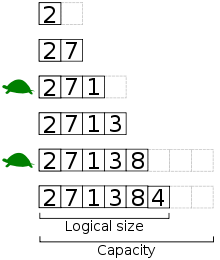

# What you need to know

According to the book.

## Linked Lists

A linked list is a linear collection of data elements, called nodes, each pointing to the next node
by means of a pointer. Together it represents a sequence.

## Binary Trees

A binary tree is a data structure in which each node has at most two childer.

## Tries

A trie, also called a digital tree, radix tree or prefix tree, is a kind of search tree. It is an
ordered tree data structure that is used to store a dynamic set or associative array where the keys
are usually strings.

## Stacks

A stack is a collection of elements with two principal operations:

1. push (adds an element ot the collection)
2. pop (removes the most recently added element from the collection)

## Queues

A queue is a data type or collection in which the entities in the collection are kept in order and
the principal operations n the collection are the addition of entities to the rear terminal
position, known as enqueue, and removal of entites from the front terminal position, known as
dequeue.

## Vectors / ArrayLists

Also known as dynamic arrays.

A dynamic array is a list data structure that allows elements to be added or removed. It is supplied
with standard libraries in many modern languages.

It has a logical size and a capacity. The capacity is increased when the bounds of the array
segments are met.

## Hash Tables

A hash table (hash map) is a data structure used to implement an associative array, which is a
structure that can map keys to values. A hash table uses a hash function to compute an index into
an array of buckets or slots, from which the desired value can be found.

## Breadth first search

BFS is an algorithm for traversing or searching tree or graph data structures. It starts at the root
and explores the neighbors first, before moving to the next level neighbors. Typically, this is
accomplished using a queue.

## Depth first search

DFS is an algorithm for traversing or searching tree or graph data structures. One starts at the
root and explores as far as possible along each branch before backtracking.

## Binary search

Binary search is a search algorithm that finds the position of a target value within a sorted array.

## Merge sort

Merge sort is a divide and conquer sorting algorithm that divides the unsorted lists into `n`
sub-lists, each containing 1 element. Then, repeatedly merge sublists to produce new sorted
sub-lists until there is only 1 sub-list remaining. This will be the sorted list.

## Quick sort

Quick sort is an efficient sorting algorithm. Its runtime is `O(n log n)`. The algorithm works as
follows:

1. Pick an element, called a pivot, from the array.
2. Reorder the array so that all elements within the array that are less than the pivot come before
   the pivot.
3. Recursively apply the above steps to the sub-arrays.

## Tree insert, find, etc.

This becomes more complex as the need to rebalance trees is introduced. AVL trees and red-black
trees are examples of implementations for self-balancing binary trees.

## Bit manipulation

1. 4-bit integer: `0xA` (16 possible values, 2^4 = 16).
2. 8-bit integer: `0xA0`
3. 16-bit integer: `0x0CA0`
4. 32-bit integer: `0x00000CA0`
4. 64-bit integer: `0xAAAABBBBCCCCDDDD`

## Singleton design pattern

Restrict instantiation to one object. Useful when exactly one object is needed to operate a system.

## Factory design pattern

A class-based programming pattern that uses factory methods to create objects without having to
specify the exact class of the object that will be created.

## Memory (stack vs. heap)

The stack is used for static memory allocation whereas the heap is used for dynamic memory
allocation.

## Recursion

When something is defined in terms of itself.

## Big-O Time

Big-O time is a mathematical notation that describes the limiting behavior of a function when the
argument tends toward a particular value or toward infinity.
